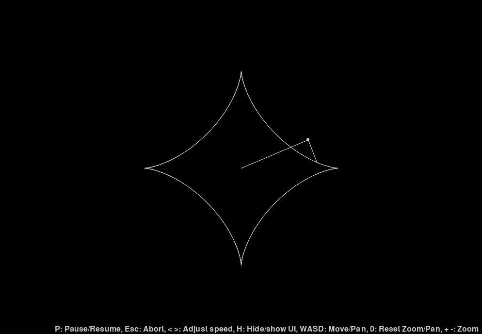

# Spinning Lines Visualization

## Table of Contents

- [Overview](#overview)
- [Features](#features)
- [Installation](#installation)
- [Usage](#usage)
- [Controls](#controls)
- [Customization](#customization)
- [License](#license)
- [Acknowledgements](#acknowledgements)

## Overview

The **Spinning Lines Visualization** is an interactive Python application built using [Pygame](https://www.pygame.org/news). It allows users to create and manipulate a dynamic system of rotating lines, offering real-time control over various parameters such as line lengths, rotation speeds, zoom levels, and panning. This visualization serves as both an educational tool to demonstrate rotational motion and a creative canvas for designing intricate patterns.

## Features

- **Dynamic Line Configuration:**
  - Add or remove rotating lines effortlessly.
  - Specify the length and rotation speed for each line.
  - Customize joint points with selectable colors.

- **Interactive Controls:**
  - **Zooming:** Seamlessly zoom in and out to explore different levels of detail.
  - **Panning:** Navigate across the visualization to focus on specific areas.
  - **Speed Adjustment:** Increase or decrease the rotation speed dynamically.
  - **Pause/Resume:** Temporarily halt the animation and resume at will.
  - **UI Toggle:** Show or hide UI components for an unobstructed view.
  - **Reset View:** Quickly reset zoom and pan to default settings with a single key press.

- **Visual Enhancements:**
  - Anti-aliased lines for smooth and visually appealing graphics.
  - Traces of rotating lines and joints to visualize motion paths.
  - Flashing text feedback displaying current speed, zoom, and pan status.

- **User-Friendly Interface:**
  - Intuitive input screens for configuring lines and joints.
  - Real-time feedback and visual indicators to enhance user experience.

## Installation

### Prerequisites

- **Python 3.6 or higher:** Ensure that Python is installed on your system. You can download it from the [official website](https://www.python.org/downloads/).

- **Pygame Library:** The application relies on Pygame for rendering graphics and handling user input.

### Installation Steps

1. **Clone the Repository:**

   git clone <https://github.com/yourusername/spinning-lines-visualization.git>

2. **Navigate to the Project Directory:**

   cd spinning-lines-visualization

3. **Create a Virtual Environment (Optional but Recommended):**

   python -m venv venv

4. **Activate the Virtual Environment:**

   - **Windows:**

     venv\Scripts\activate

   - **macOS/Linux:**

     source venv/bin/activate

5. **Install Dependencies:**

   Install all required dependencies using the `requirements.txt` file:

   pip install -r requirements.txt

   This command will install Pygame and any other necessary libraries specified in the `requirements.txt` file.

## Usage

Once the installation is complete, you can launch the application and start creating your spinning lines visualization.

### Running the Application

1. **Navigate to the Project Directory:**

   cd spinning-lines-visualization

2. **Run the Application:**

   python main.py

   This command will launch the application window, presenting you with the configuration interface to set up your spinning lines.

## Controls

Enhance your interaction with the visualization using the following keyboard shortcuts:

- **P:** Pause or resume the animation.
- **Esc:** Abort the current visualization and return to the configuration screen.
- **< >:** Decrease or increase the rotation speed of the lines.
- **H:** Hide or show UI components, including lines, joints, and informational texts.
- **W A S D:** Pan the visualization:
  - **W:** Pan down.
  - **A:** Pan right.
  - **S:** Pan up.
  - **D:** Pan left.
- **0:** Reset zoom to the default level (`1.0x`) and center the visualization.
- **+ -:** Zoom in or out of the visualization.

### Mouse Controls

- **Scroll Wheel Up:** Zoom in.
- **Scroll Wheel Down:** Zoom out.

## Customization

The application offers extensive customization options to tailor the visualization to your preferences:

### Adding or Removing Lines

- **Add Line:** Click the "Add Line" button to introduce a new rotating line. Configure its length and rotation speed as desired.
- **Remove Line:** Click the "Remove Line" button to delete the most recently added line.

### Configuring Lines

- **Length:** Specify the length of each line in pixels.
- **Speed:** Define the rotation speed in radians per frame. Positive values rotate clockwise, while negative values rotate counterclockwise.

### Managing Joints

- **Joint Points:** For visual complexity, enable joints between lines. Assign distinct colors to each joint to differentiate them within the visualization.

## License

This project is licensed under the [MIT License](LICENSE). You are free to use, modify, and distribute it as per the terms of the license.

## Acknowledgements

- **Pygame:** A set of Python modules designed for writing video games, providing functionalities like graphics rendering and input handling.
- **OpenAI:** For providing guidance and support in developing this project.
- **Community Contributors:** Special thanks to all the developers and contributors who have supported this project through feedback and suggestions.
